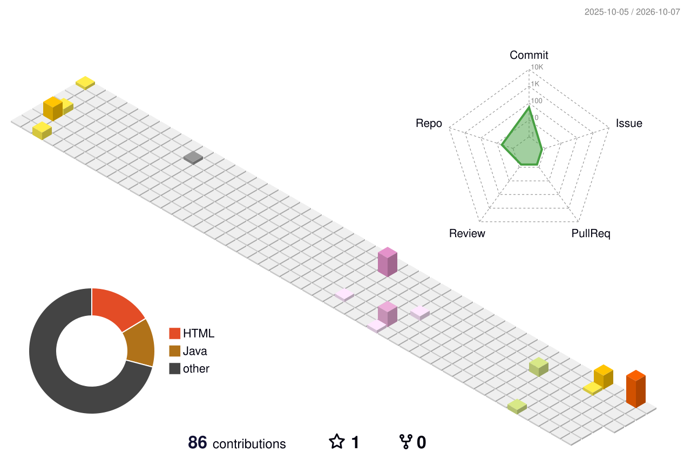
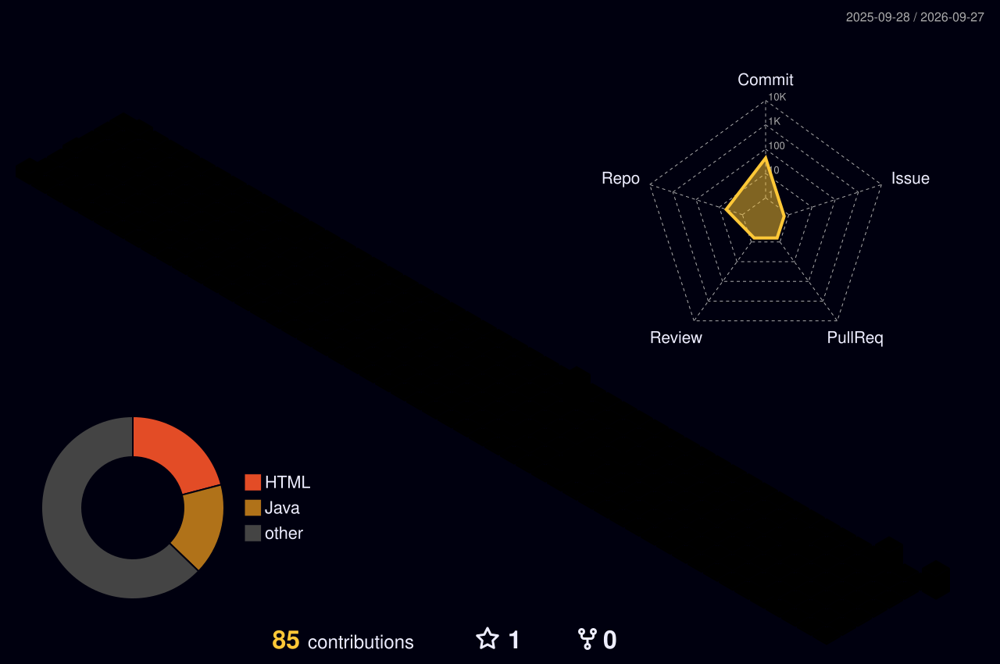

<div align="center">


<br/>


<br/><br/>

<table>
<tr>
<td align="center" width="34%">

</td>
<td align="center" width="66%">

# ✦ ITSTELAX ✦

### JVM Mage · Quest Architect · End-Touched Developer


<br/>


<br/><br/>

<a href="https://github.com/voidunnamed"></a>
<a href="https://discord.gg/gVnpRqV5zW"></a>

<br/><br/>


</td>
</tr>
</table>

</div>

---

## 🏰 Character Codex

```yaml
identity: Void
minecraft_ign: ItStelax
class: JVM Mage
subclass: Quest Architect
realm: Minecraft RPG
affinity: The End
primary_weapon: Java 21
forge: Maven
spellbook: IntelliJ IDEA
current_raid: CozyHouse
ultimate_goal: Build worlds worth exploring
```

I’m a development student specialized in the **JVM ecosystem**, building **Minecraft RPG systems**, **plugin architectures**, quest engines, progression mechanics and everything that turns a collection of features into a living world.

> *“This should be a quick feature.”*  
> — the sentence immediately before creating another entire subsystem.

---

<div align="center">


</div>

## 🧙 Class Selection

<table>
<tr>
<td width="33%" align="center">

### ☕ JVM Mage
**Main Class**

Java 21 · JVM · OOP · Generics · APIs


</td>
<td width="33%" align="center">

### 📜 Quest Architect
**Subclass**

Questlines · NPCs · Conditions · Objectives · Rewards


</td>
<td width="33%" align="center">

### 🏰 World Builder
**Secondary Path**

Progression · Waypoints · Game Flow · Systems


</td>
</tr>
</table>

---

## 🔮 Arcane Resource Bars

<div align="center">


<br/><br/>

`MANA` ✦████████████████████✦ **MAX**  
`XP  ` ✦█████████████████░░░✦ **NEXT QUEST**  
`FOCUS` ✦██████████████████░░✦ **QUEST ENGINE**

</div>

---

<div align="center">


</div>

## 📖 Spellbook

<div align="center">


</div>

| Spell | School | Effect |
| --- | --- | --- |
| ☕ **JVM Invocation** | Java 21 | Turns game ideas into strongly typed systems |
| 🧱 **World Binding** | Spigot / Paper | Connects code to the Minecraft realm |
| 🔨 **Forge Artifact** | Maven | Builds, shades and assembles modules |
| 📜 **Quest Weaving** | RPG Architecture | Connects triggers, conditions, objectives and rewards |
| 🧙 **NPC Chronicle** | Dialogue Systems | Gives characters ordered storylines |
| 🧭 **Wayfinder** | World UX | Guides players without breaking immersion |
| 🛡 **Modular Ward** | Architecture | Protects the codebase from future feature creep |
| ⏳ **Timeline Reversal** | Git | Restores reality after a questionable refactor |

---

## 🗺️ Quest Timeline

```text
[✓] AWAKENING
    └─ Java / JVM path chosen
       │
[✓] FIRST FOUNDATIONS
    └─ Minecraft plugin architecture
       │
[✓] EXPERIENCE REQUIRED
    └─ Custom progression systems
       │
[✓] THE MODULAR FORGE
    └─ Multi-module ecosystem
       │
[●] THE QUEST ARCHITECT
    └─ Flexible quest engine
       │
[●] NPCs HAVE STORIES
    └─ Ordered NPC questlines
       │
[●] FOLLOW THE MARKER
    └─ Immersive waypoint system
       │
[ ] THE LIVING WORLD
    └─ Quests + progression + NPCs + world flow
       │
[?] ENDGAME
    └─ Something I have not overengineered yet
```

---

## 👑 Boss Raid — CozyHousePlugin

> **Boss Type:** Long-term Main Project  
> **Raid Status:** 🟣 ACTIVE  
> **Difficulty:** ★★★★★  
> **Loot:** A complete RPG ecosystem

<div align="center">

<a href="https://github.com/voidunnamed/CozyHousePlugin">

</a>

</div>

<details open>
<summary><b>⚔ Open Raid Objectives</b></summary>

<br/>

- [x] Establish the plugin foundation
- [x] Build experience / progression systems
- [x] Create modular architecture
- [ ] Forge a deeply flexible **quest engine**
- [ ] Make quests originate naturally from **NPC dialogue**
- [ ] Support ordered **NPC questlines**
- [ ] Build reusable **conditions, triggers, objectives and rewards**
- [ ] Add immersive **waypoints and world guidance**
- [ ] Support unusual RPG tasks — even something like *sweeping an inn*
- [ ] Connect quests, progression and world systems into one living framework

<div align="center">

[](https://github.com/voidunnamed/CozyHousePlugin)

</div>

</details>

---

## 🪄 Side Boss — EnchantPlusMod

<div align="center">

<a href="https://github.com/voidunnamed/EnchantPlusMod">

</a>

</div>

---

<div align="center">


</div>

## ✨ Arcane Metrics — The Observatory

<div align="center">

### 🌌 Core Character Analytics


<sub>Full-year isometric calendar, language usage and code-volume metrics generated by Lowlighter Metrics.</sub>

<br/><br/>

### ⏳ Chronomancy


<sub>When the mage actually codes: activity hours, days, habits and recent language patterns.</sub>

<br/><br/>

### 🏆 Arcane Achievements


<br/><br/>

### 📖 Living Grimoire


<sub>A Java spell fragment selected automatically from recent public code activity.</sub>

<br/><br/>

### 🗃 Quest Archive


<br/><br/>

### 🌃 End Skyline


</div>

---

## 📊 Guild Records

<div align="center">


<br/>


<br/><br/>


<br/>


<br/>


</div>

---

## 🏆 Achievement Hall

<div align="center">


</div>

| Advancement | Objective | Status |
| --- | --- | :---: |
| ☕ **The JVM Awakens** | Choose Java as the main class | ✅ |
| 🧱 **First Foundations** | Build real Minecraft plugin systems | ✅ |
| ✨ **Experience Required** | Build custom progression | ✅ |
| 📜 **A Quest Appears!** | Begin a true RPG quest architecture | ✅ |
| 🧙 **NPCs Have Stories Too** | Ordered NPC questlines | 🟣 |
| 🗺 **Follow the Marker** | Immersive waypoint system | 🟣 |
| 🏰 **The Living World** | Connect every RPG system | 🔒 |
| 🐉 **The Final Refactor** | Finish the final refactor | **IMPOSSIBLE** |

---

## 🐍 End-Magic Familiar

<div align="center">

<picture>
  <source media="(prefers-color-scheme: dark)" srcset="https://raw.githubusercontent.com/voidunnamed/Void/output/github-contribution-grid-snake-dark.svg" />
  <source media="(prefers-color-scheme: light)" srcset="https://raw.githubusercontent.com/voidunnamed/Void/output/github-contribution-grid-snake.svg" />
  
</picture>

</div>

---

## 🏙️ 3D Contribution Realm

<div align="center">

### ✦ Animated World Map



<br/>

<details>
<summary><b>🌌 Open the Night-Realm variant</b></summary>
<br/>



</details>

</div>

---

## 🔮 Oracle of the Repository

<div align="center">


<br/><br/>


</div>

---

## ❤️ Adventurer HUD

```text
ITSTELAX                                       CLASS: JVM MAGE

❤ ❤ ❤ ❤ ❤ ❤ ❤ ❤ ❤ ❤      HEALTH     STABLE
🛡 🛡 🛡 🛡 🛡 🛡 🛡 ◇ ◇ ◇      ARMOR      MODULAR
✦ ✦ ✦ ✦ ✦ ✦ ✦ ✦ ✦ ✦      MANA       MAXIMUM
🍗 🍗 🍗 🍗 🍗 🍗 ◇ ◇ ◇ ◇      HUNGER     CODE FIRST

XP [██████████████████████████████████████████] NEXT QUEST...
```

---

## 🔮 Summon the Mage

<div align="center">

**Cursed Java bug? Strange Minecraft mechanic? RPG idea that deserves to become unnecessarily ambitious?**

<br/><br/>

<a href="https://github.com/voidunnamed">

</a>

<a href="https://discord.gg/gVnpRqV5zW">

</a>

<br/><br/>

<sub>Live Minecraft render powered by <a href="https://mc-heads.net">MCHeads</a>.</sub>

<br/><br/>

### ✦ The quest continues. ✦


</div>