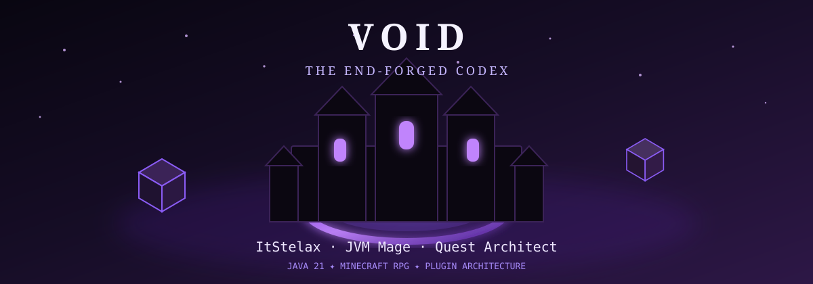
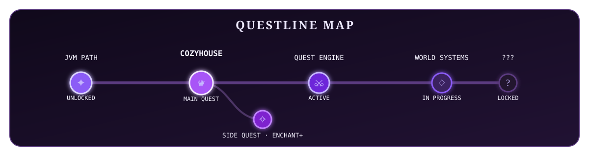

<div align="center">



<br/>


### ✦ ITSTELAX ✦

**JVM Mage · Quest Architect · Builder of RPG Systems**


<br/><br/>

<a href="https://github.com/voidunnamed">
  
</a>
<a href="https://discord.gg/gVnpRqV5zW">
  
</a>

<br/><br/>


</div>


## 🜲 Character Sheet

<table>
<tr>
<td width="50%">

| Attribute | Value |
| --- | --- |
| **Name** | Void |
| **Minecraft IGN** | ItStelax |
| **Class** | JVM Mage |
| **Subclass** | Quest Architect |
| **Realm** | Minecraft · Spigot · Paper |
| **Affinity** | The End |
| **Primary Weapon** | Java 21 |
| **Forge** | Maven |
| **Spellbook** | IntelliJ IDEA |
| **Current Raid** | CozyHouse |

</td>
<td width="50%">

### ⚔ Adventurer Profile

Development student specialized in the **JVM ecosystem**, obsessed with turning game ideas into systems that feel alive.

I build **Minecraft RPG mechanics**, progression systems, quest engines and modular plugin architectures — usually starting with a *small feature* and ending up designing an entire framework around it.

My favorite loop:

**Imagine → Build → Break → Understand → Refactor → Add another system**

</td>
</tr>
</table>


## 📜 Lore of the End-Forged Developer

> Beyond the last stronghold, where medieval towers overlook forests touched by End magic,  
> there is a workshop lit by enchanted code.
>
> **Void**, known in-game as **ItStelax**, does not forge swords.
>
> He forges **systems**: questlines with consequences, progression that rewards exploration, NPCs with stories, mechanics that connect together, and plugins built to survive the next *"what if we added..."*.
>
> The goal is not simply to make Minecraft features.
>
> **The goal is to make worlds worth exploring.**


## 🗺️ The Questline

<div align="center">



</div>

### 👑 MAIN QUEST — CozyHouse

> **Quest Type:** Epic / Long-term  
> **Status:** 🟣 ACTIVE  
> **Recommended Class:** Architect  
> **Difficulty:** ★★★★★

<details open>
<summary><b>📖 Open Quest Journal</b></summary>

<br/>

**Objective:** build a complete Minecraft RPG ecosystem where quests, NPCs, progression and world interactions feel connected instead of being isolated features.

#### 🎯 Current objectives

- [x] Establish the core plugin ecosystem
- [x] Build a custom experience / progression foundation
- [x] Create modular project structure
- [ ] Forge a deeply flexible **quest engine**
- [ ] Make quests originate naturally from **NPC dialogue**
- [ ] Support ordered NPC storylines and character progression
- [ ] Build reusable **conditions**, **objectives**, **triggers** and **rewards**
- [ ] Add immersive **waypoints / world guidance**
- [ ] Support unusual objectives — even something as simple as *sweeping an inn*
- [ ] Make the architecture flexible enough for future RPG mechanics without rewriting the entire realm

<br/>

<div align="center">

<a href="https://github.com/voidunnamed/CozyHousePlugin">
  
</a>

<br/>

[](https://github.com/voidunnamed/CozyHousePlugin)

</div>

</details>

### ✧ SIDE QUEST — EnchantPlus

> **Quest Type:** Arcane Experiment  
> **Status:** 🟪 DISCOVERED  
> **Reward:** More ideas than originally planned

<details>
<summary><b>🔮 Inspect Side Quest</b></summary>

<br/>

An experimental branch of the adventure focused on custom mechanics and content design.

<div align="center">

<a href="https://github.com/voidunnamed/EnchantPlusMod">
  
</a>

</div>

</details>

### 🔒 UNKNOWN QUESTS

> More quest markers exist beyond the fog of war.  
> They will probably begin with: **"this shouldn't take too long."**


## 🎒 Inventory & Relics

<div align="center">


<br/><br/>


</div>

<br/>

| Slot | Relic | Enchantment |
| ---: | --- | --- |
| ⚔ | **Java 21** | `Sharpness JVM` · Main weapon |
| 🔨 | **Maven** | `Forge of Packaging` · Builds and modules |
| 🧱 | **Spigot / Paper** | `World Binding` · Minecraft systems |
| 📖 | **IntelliJ IDEA** | `Arcane Insight` · Primary spellbook |
| 🧭 | **Git** | `Timeline Control` · Versioning and recovery |
| 🏰 | **Architecture** | `Unbreaking III` · Modular and extensible systems |


## 🌌 Skill Tree

```text
                         ✦ VOID — JVM PATH ✦

                              [ JAVA ]
                                 │
                 ┌───────────────┼───────────────┐
                 │               │               │
            [ JVM CORE ]   [ ARCHITECTURE ]  [ MINECRAFT ]
                 │               │               │
            Collections      Modularity      Spigot / Paper
            Generics         Services        Events
            OOP              APIs            NPC Systems
                 │               │               │
                 └───────────────┼───────────────┘
                                 │
                         [ RPG SYSTEMS ]
                                 │
                 ┌───────────────┼───────────────┐
                 │               │               │
              Quests        Progression       World Flow
                 │               │               │
                 └───────────────┼───────────────┘
                                 │
                         [ ??? LOCKED ??? ]
```

### ✨ Current Masteries

```text
Java / JVM             ████████████████████  MAIN PATH
Plugin Architecture    ██████████████████░░  MASTERING
RPG Systems            █████████████████░░░  MASTERING
Quest Architecture     ██████████████████░░  ACTIVE
Clean Code             ████████████████░░░░  ALWAYS REFACTORING
Scope Control          ███░░░░░░░░░░░░░░░░░  CRITICAL FAILURE
```


## 🏆 Advancements

| Advancement | Description | Status |
| --- | --- | :---: |
| **☕ The JVM Awakens** | Choose Java as the main class | ✅ |
| **🧱 First Foundations** | Build real Minecraft plugin systems | ✅ |
| **🗃 Modular Mindset** | Split large systems into reusable modules | ✅ |
| **✨ Experience Required** | Create a custom progression foundation | ✅ |
| **📜 A Quest Appears!** | Begin building a full RPG quest architecture | ✅ |
| **🧙 NPCs Have Stories Too** | Turn NPCs into ordered questline characters | 🟣 |
| **🗺 Follow the Marker** | Add immersive world guidance / waypoints | 🟣 |
| **🏰 The Living World** | Connect quests, NPCs and progression into one ecosystem | 🔒 |
| **🐉 The Final Refactor** | Complete the last refactor | **IMPOSSIBLE** |


## 📊 Guild Records

<div align="center">


<br/>


<br/>


</div>


## ❤️ Adventurer HUD

```text
ITSTELAX                                              Lv. JVM

❤ ❤ ❤ ❤ ❤ ❤ ❤ ❤ ❤ ❤        HEALTH      STABLE
🛡 🛡 🛡 🛡 🛡 🛡 🛡 ◇ ◇ ◇        ARMOR       REINFORCING
✦ ✦ ✦ ✦ ✦ ✦ ✦ ✦ ✦ ✦        MANA        OVERENGINEERING
🍗 🍗 🍗 🍗 🍗 🍗 ◇ ◇ ◇ ◇        HUNGER      CODE FIRST, FOOD LATER

XP  [██████████████████████████████████████████]  NEXT LEVEL...
```


## 🔮 Summon the Mage

<div align="center">

**Found a strange system to build? A cursed Java bug? An RPG idea that should absolutely be bigger than necessary?**

<br/>

<a href="https://github.com/voidunnamed">
  
</a>
<a href="https://discord.gg/gVnpRqV5zW">
  
</a>

<br/><br/>


<br/><br/>

<sub>
Thanks to <a href="https://mc-heads.net">MCHeads</a> for the live Minecraft skin render.
</sub>

<br/><br/>

### ✦ The quest continues. ✦

</div>

